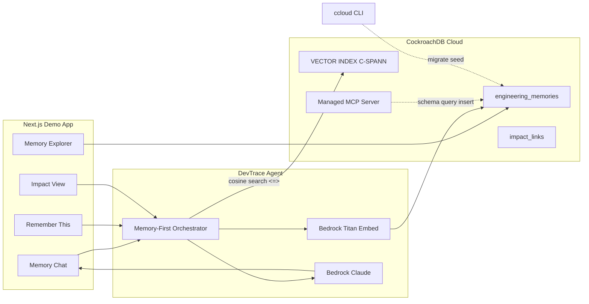

# DevTrace AI Architecture

## Overview

DevTrace AI is an **engineering memory agent**. Persistent knowledge (ADRs, incidents, onboarding notes, feature context) lives in **CockroachDB Cloud**. **Amazon Bedrock** embeds that knowledge and generates answers. Retrieval is **memory-first**: vector search over engineering memory, then optional codebase context, then LLM synthesis.

## Memory-first Q&A

1. Embed the user question with **Bedrock Titan Embed Text v2** (1024-dim).
2. Cosine search `engineering_memories.embedding` using CockroachDB `<=>` accelerated by **C-SPANN vector index**.
3. Load matching **impact_links** for production blast-radius context.
4. Optionally read relevant files from `demo/shopflow`.
5. **Claude on Bedrock** answers with explicit memory citations.
6. Optional: **Remember this** embeds + inserts a new memory row.

## Data model

- `projects` — e.g. ShopFlow
- `engineering_memories` — typed knowledge + `VECTOR(1024)` embedding
- `impact_links` — code path → feature / users / APIs / downstream / severity
- `conversations` / `messages` — demo observability of Q&A with `memory_ids`

## CockroachDB tools

| Tool | Role |
|------|------|
| Distributed Vector Indexing | Semantic RAG over engineering memory |
| Managed MCP Server | Agent/IDE access to the same memory DB |
| ccloud CLI | Ops: SQL migrate/seed against Cloud |

## AWS

| Service | Role |
|---------|------|
| Amazon Bedrock | Embeddings + LLM reasoning |

## Production-readiness notes (MVP)

- Secrets via env (never commit `.env.local`)
- `/api/health` checks DB connectivity
- Conversation rows log which memory IDs informed each answer
- SSL to CockroachDB Cloud; Bedrock IAM-scoped credentials
